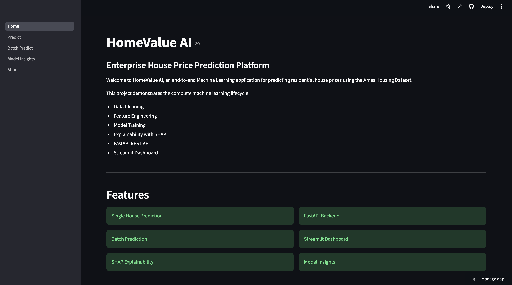
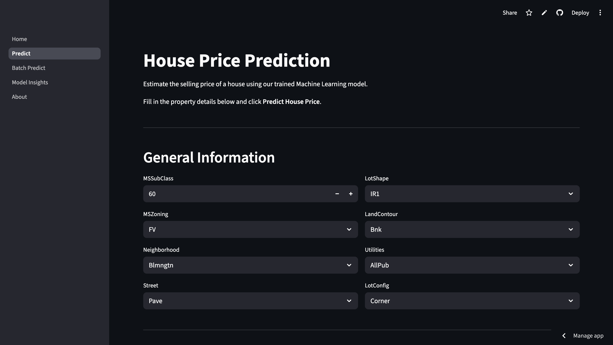
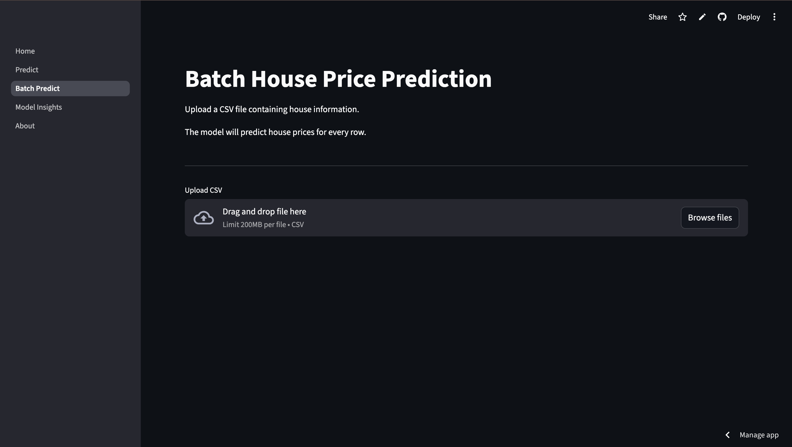
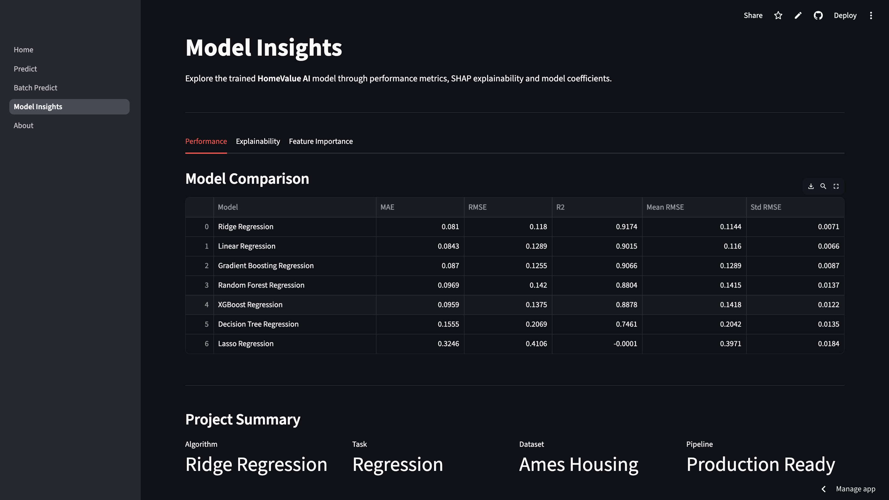

# HomeValue AI

## Overview

HomeValue AI is an end-to-end Machine Learning application for predicting residential house prices using the **Ames Housing Dataset**. The project covers the complete ML lifecycle, including data preprocessing, feature engineering, model training, SHAP-based explainability, FastAPI model serving, and an interactive Streamlit dashboard. It demonstrates a production-ready workflow with support for both single and batch predictions.

## Features

- **Single House Prediction** – Predict the selling price of an individual house.
- **Batch Prediction** – Upload a CSV file to generate predictions for multiple properties.
- **Machine Learning Pipeline** – Automated preprocessing, feature engineering, and inference.
- **Model Explainability** – SHAP visualizations for interpreting model predictions.
- **FastAPI Backend** – RESTful API with single and batch prediction endpoints.
- **Interactive Dashboard** – Multi-page Streamlit application with an intuitive interface.
- **Cloud Deployment** – Backend hosted on Render and frontend on Streamlit Community Cloud.
- **Production-Ready Architecture** – Modular codebase with separated frontend, backend, and ML pipeline.

## System Architecture

```text
                    User
                      │
                      ▼
           Streamlit Dashboard
                      │
          HTTPS REST API Request
                      │
                      ▼
              FastAPI Backend
                      │
                      ▼
          Prediction Pipeline
                      │
          Data Preprocessing
                      │
                      ▼
         Ridge Regression Model
                      │
                      ▼
          Predicted House Price
```

## Machine Learning Workflow

```text
      Raw Dataset
            │
            ▼
      Exploratory Data Analysis
            │
            ▼
      Data Cleaning
            │
            ▼
      Feature Engineering
            │
            ▼
      Data Preprocessing
            │
            ▼
      Model Training
            │
            ▼
      Hyperparameter Tuning
            │
            ▼
      SHAP Explainability
            │
            ▼
      FastAPI Deployment
            │
            ▼
      Streamlit Dashboard
```

## Project Structure

```text
HomeValue-AI
│
├── api/                
├── app/                
│   ├── components/
│   ├── pages/
│   └── assets/
│
├── artifacts/          
├── data/
│   ├── raw/
│   ├── processed/
│   └── external/
│
├── models/             
├── notebooks/          
├── src/
│   ├── data/
│   ├── features/
│   ├── preprocessing/
│   ├── models/
│   ├── pipelines/
│   ├── utils/
│   └── visualization/
│
├── train.py            
├── requirements.txt
└── README.md
```

## Tech Stack

| Category | Technologies |
|----------|--------------|
| Programming | Python |
| Data Processing | Pandas, NumPy |
| Machine Learning | Scikit-learn |
| Explainability | SHAP |
| Visualization | Matplotlib |
| Backend | FastAPI, Uvicorn, Pydantic |
| Frontend | Streamlit |
| Version Control | Git, GitHub |
| Deployment | Render, Streamlit Community Cloud |

## Dataset

- **Data:** Ames Housing Dataset
- **Problem Type:** Regression
- **Target Variable:** `SalePrice`
- **Features:** 79 housing attributes

## Results

- **Model Used:** Ridge Regression


### Model Performance

| Metric | Score |
|--------|-------:|
| **Model** | Tuned Ridge Regression |
| **MAE** | **0.0784** |
| **RMSE** | **0.1160** |
| **R² Score** | **0.9202** |

## Model Comparison

Several regression algorithms were evaluated and compared using MAE, RMSE, R² Score, and 5-Fold Cross Validation.

| Model | MAE | RMSE | R² Score | CV Mean RMSE |
|-------|----:|-----:|---------:|-------------:|
| **Ridge Regression** | **0.0810** | **0.1180** | **0.9174** | **0.1144** |
| Linear Regression | 0.0843 | 0.1289 | 0.9015 | 0.1160 |
| Gradient Boosting | 0.0870 | 0.1255 | 0.9066 | 0.1289 |
| Random Forest | 0.0969 | 0.1420 | 0.8804 | 0.1415 |
| XGBoost | 0.0959 | 0.1375 | 0.8878 | 0.1418 |
| Decision Tree | 0.1555 | 0.2069 | 0.7461 | 0.2042 |
| Lasso Regression | 0.3246 | 0.4106 | -0.0001 | 0.3971 |

**Ridge Regression achieved the best overall performance**, with the lowest cross-validation RMSE and the highest predictive accuracy after hyperparameter tuning.

## SHAP Explainability

To improve model transparency, SHAP (SHapley Additive Explanations) is integrated into the project.

Available visualizations include:

- SHAP Summary Plot
- SHAP Beeswarm Plot
- SHAP Waterfall Plot
- SHAP Decision Plot
- SHAP Dependence Plots
- Ridge Coefficient Analysis

## REST API

| Method | Endpoint | Description |
|----------|-----------|-------------|
| GET | `/` | Welcome endpoint |
| GET | `/health` | Health check |
| POST | `/predict` | Predict a single house price |
| POST | `/batch_predict` | Predict prices for multiple houses |

API documentation is available through **Swagger UI** after starting the backend:

```text
http://127.0.0.1:8000/docs
```

or via the deployed API:

```text
https://homevalue-ai-api.onrender.com/docs
```

## Deployment

The application is deployed using separate frontend and backend services.

| Service | Platform |
|----------|----------|
| Frontend | Streamlit Community Cloud |
| Backend | Render |
| API Framework | FastAPI |

### Live Demo

**Frontend:**  
https://homevalue-ai-app.streamlit.app/

**Backend API:**  
https://homevalue-ai-api.onrender.com

**Swagger Docs:**  
https://homevalue-ai-api.onrender.com/docs


## Installation

Clone the repository:

```bash
git clone https://github.com/saidattaputta/HomeValue-AI.git
cd HomeValue-AI
```

Create a virtual environment:

```bash
python -m venv venv
```

Activate the environment:

**Windows**

```bash
venv\Scripts\activate
```

**Linux / macOS**

```bash
source venv/bin/activate
```

Install dependencies:

```bash
pip install -r requirements.txt
```

Run the FastAPI backend:

```bash
uvicorn api.main:app --reload
```

Run the Streamlit application:

```bash
streamlit run app/app.py
```

## Screenshots

| Page | Preview |
|------|---------|
| Home |  |
| Prediction |  |
| Batch Prediction |  |
| Model Insights |  |

## Future Improvements

- Docker containerization
- CI/CD pipeline using GitHub Actions
- Model versioning
- Cloud storage integration
- User authentication
- Database integration
- Model monitoring & logging
- Support for additional regression models
- Automated model retraining
- Improved UI/UX

## Developer

**Sai Datta Putta**

Integrated M.Sc. Mathematics  
National Institute of Technology Warangal

**Interests**

- Machine Learning
- Artificial Intelligence
- Data Science
- MLOps

---
